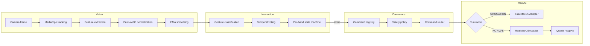

# Architecture

This document explains how GestureOS is put together: the pipeline
data flow, the types that pass between stages, and the reasoning behind
the bigger design decisions. For "what to run and when," see the main
[README](../README.md). For "why does X happen" at runtime, see
[TROUBLESHOOTING.md](TROUBLESHOOTING.md).

## Pipeline overview

Every frame, when a camera is available, data flows one direction
through five layers. Nothing downstream ever reaches back upstream —
the command layer never touches vision code, and vision code never
imports anything macOS-specific.

`gestureos/app.py`'s `_update_pipeline()` is the only place all five
layers are wired together; every module above it is independently
importable and independently tested without the others.

## Data types between stages

Each arrow above is a specific, typed handoff — nothing passes raw
dicts or tuples of primitives between layers:

| From → To | Type | Defined in |
|---|---|---|
| MediaPipe → Features | `RawHand` (21 `Landmark`s + handedness) | `vision/tracker.py` |
| Features → Normalization/Smoothing | `HandFeatures` / `FrameFeatures` | `vision/features.py` |
| State machine → Commands | `Intent` (gesture, phase, confidence, position) | `interaction/state_machine.py` |
| Registry/Router → Adapter | `Command` (type, source gesture/phase, params) | `commands/types.py` |

`Intent` and `Command` are deliberately different types even though
they look similar — an `Intent` is "the gesture layer's best
understanding of what just happened," a `Command` is "what the safety
policy approved dispatching." Collapsing them would make it easy to
accidentally skip the safety check.

## Per-hand state, not global state

Every stateful component in the interaction and command layers —
`GestureStateMachine`, `ConfidenceTracker`, `DragController`,
`ScrollController`, `SwipeController` — is either instantiated once per
handedness label (`"left"`/`"right"`) or keeps state that's implicitly
scoped to one in-progress gesture. This is why two hands can pinch,
scroll, or swipe independently without one hand's motion corrupting the
other's — verified directly in `tests/test_stress.py`, which checks the
engine's per-hand dictionary never grows past 2 entries no matter how
adversarial the input sequence is.

## Why a fake adapter and a real adapter share one interface

`macos/adapter.py`'s `MacOSAdapter` is a `Protocol`, not a base class —
`FakeMacOSAdapter` (Simulation Mode) and `RealMacOSAdapter` (Quartz/
AppKit) both satisfy it independently. The command router only ever
depends on the Protocol, so:

- Every test in this project except `test_real_adapter.py` itself runs
  against the fake adapter, meaning almost the entire pipeline is
  tested without a real Mac.
- Adding real macOS behavior for a new command (Phase 6 through 9, one
  command type at a time) never required touching the router.
- Methods not yet implemented on `RealMacOSAdapter` raise
  `NotImplementedError` rather than silently doing nothing — the router
  catches that specifically (see `CommandRouter.route_intent`) and logs
  it, so a not-yet-built command degrades safely instead of crashing.

## Why safety is a separate layer from the router

`SafetyPolicy.check()` runs before any command reaches the router's
dispatch logic, and it doesn't know anything about *how* a command will
be executed — only whether it should be. This keeps three independent
concerns cleanly separated:

1. **What should happen** (registry: gesture → command type)
2. **Whether it's allowed right now** (safety: control-state pause,
   launch allowlist, rate limiting)
3. **How it actually happens** (router + adapter: the dispatch itself)

The one deliberate exception threading through all three layers is
`RELEASE_COMMAND_TYPES` (currently just `MOUSE_UP`): a release is
always allowed through regardless of pause state or rate limit,
because blocking a release is strictly more dangerous than allowing
one — it can leave a mouse button stuck down on the real OS.

## Why gesture-to-command bindings are a flat dict

`commands/registry.py` is a single `dict[(GestureType, IntentPhase),
CommandType]`. Every phase from 4 through 9 added bindings to this same
dict without ever touching `router.py`'s dispatch logic (only new
`CommandType`s occasionally needed a new handler method, e.g. `SCROLL`
in Phase 7). Adding a gesture binding is, by design, a one-line change.

## Reused mechanisms

Three command-layer controllers — `DragController` (Phase 6),
`ScrollController` (Phase 7), and `SwipeController` (Phase 8, reused
again in Phase 9 for Spaces) — all follow the same shape: `begin()` on
a gesture's START, `update()` on every HOLD frame, `end()` on END. Phase
9 specifically reused `SwipeController` (rather than writing a near-
duplicate) for Spaces navigation, with two independent instances so an
in-progress app-switch swipe and an in-progress Spaces swipe never
interfere with each other.

## Testing architecture

No test in this project (except one, explicitly marked) needs a real
camera, a real Mac, a real permission prompt, or real wall-clock time:

- **Vision**: `Camera` and `HandTracker` take an injectable backend;
  tests build synthetic `RawHand` poses by hand (`tests/vision_helpers.py`)
  rather than recording real MediaPipe output.
- **Timing**: every state machine, safety policy, and controller that
  cares about elapsed time takes an injectable `clock` callable. A
  real flaky-test bug during Phase 6 (wall-clock rate limiting tripping
  from Python's own per-statement overhead, not the tested logic) is
  why this is a hard rule, not just a preference.
- **macOS**: `FakeMacOSAdapter` records calls instead of making them;
  `RealMacOSAdapter`'s Quartz/AppKit calls sit behind a small backend
  Protocol the same way `Camera`'s does.
- **The one exception**: `tests/test_tracker.py` has a single test
  marked `@pytest.mark.integration` that runs the real MediaPipe
  runtime against a synthetic blank frame, as an end-to-end sanity
  check that the real dependency actually works in the current
  environment — `pytest -m "not integration"` skips it.

## What's still simulated vs. verified

Everything through the command router — vision, gesture recognition,
temporal voting, state machines, safety policy, command routing — runs
against real logic with real (if synthetic) inputs and is genuinely
tested. `RealMacOSAdapter`'s actual Quartz/AppKit calls, the live camera
feed, and on-screen cursor/click/scroll behavior have not been run
against a real Mac at any point in this project's development — there
has never been one available. The code is written to the same standard
and documented APIs as everything else, but that specific gap is real
and is called out at every phase from 5 onward rather than glossed over.
